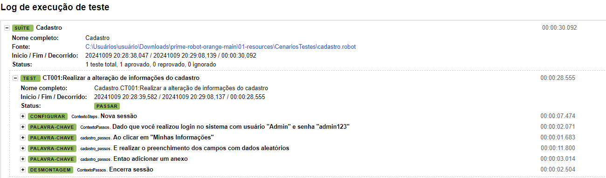
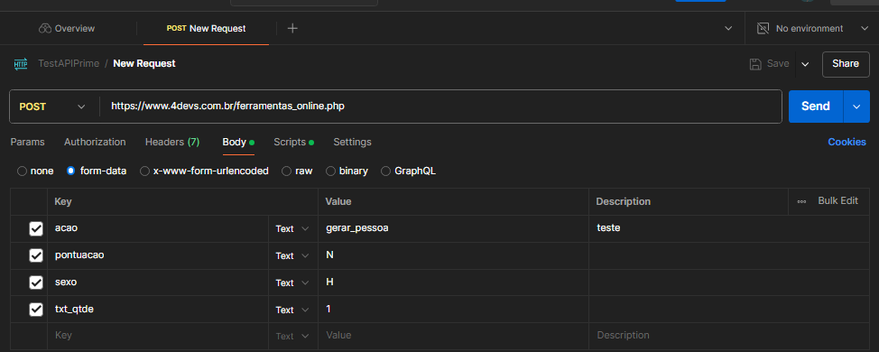
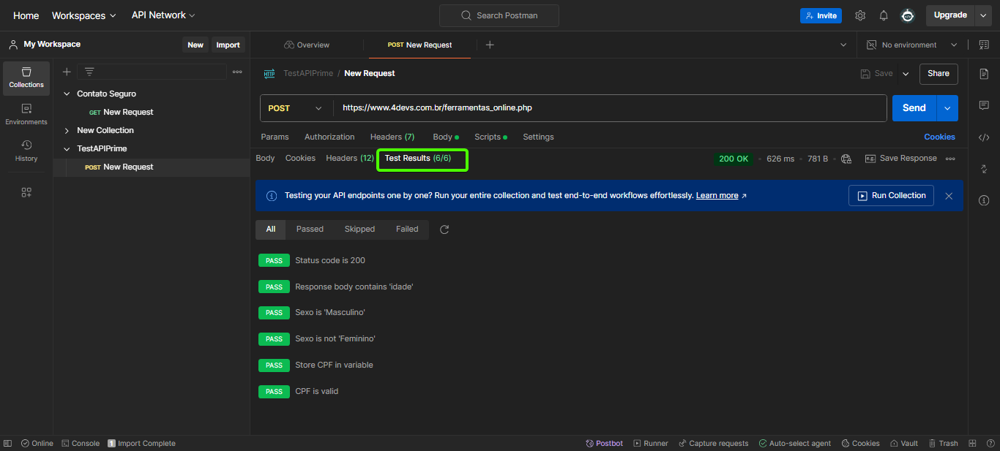

# Automação Atualização de Cadastro no OrangeHRM

### Instalar o python

    https://www.python.org/

    Na instalação marcar a opção ADD PATH na primeira tela

-   Configurar as variaveis de ambiente

-   Adicionar os caminhos na variavel de ambiente path *(OBS: em variaveis do sistema)* 
    *Exemplo:*
    C:\Users\seuusuario\AppData\Local\Programs\Python\Python39\
     C:\Users\seuusuario\AppData\Local\Programs\Python\Python39\Scripts\
    
    *OBS: necessario adicionar o chromedriver.exe na versão atual do chrome da sua maquina e coloca-lo na pasta C:\Users\seuusuario\AppData\Local\Programs\Python\Python39\Scripts\ para conseguir executar a automação.

### Editor de codigo

-   Sugestão de editor: VSCode

-   Baixar e instalar o VSCode
    https://code.visualstudio.com/download

    *OBS: só é necessario instalar se for editar o código

#### Sugestão de plugins VSCode

    Python (Microsoft)
    Robot Framework Language Server
    RobotF Extension (KMK Labs)

### Instalar as Librarys
- Para instalar as  blibliotecas necessarias acessar o arquivo de requirements.txt e executar o comando que consta nele"

### Execução do cenário de Teste
-   para execução do cenario via terminal é necessario estar na pasta prime-robot-orange e executar o comando 

    robot -d 05-results 01-resources/CenariosTestes/cadastro.robot 

    ou executar o arquivo run.bat

### Executar os testes da API
- Importar a collection no postman
- Clicar em SEND
- Após a execução navegar até Tests Results

### Importante
    A automação necessita estar no arquivo C: para execução com o run.bat e este arquivo só funciona no windows. Para visualizar o relatório gerado vá na pasta results e acesse o arquivo log.html

### Evidencias de testes

